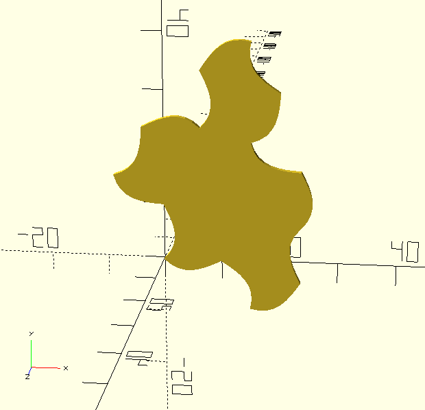

# SpectreOpenSCAD
OpenSCAD code for the Spectre tile of "A Chiral Aperiodic Monotile" by David Smith, Joseph Samuel Myers, Craig S. Kaplan, and Chaim Goodman-Strauss.

The Spectre shape is an Einstein tile, capable of aperiodic tiling of the plane.
References:
* https://arxiv.org/pdf/2305.17743.pdf
* https://en.wikipedia.org/wiki/Einstein_problem

* [Spectre.scad](Spectre.scad) - contains modules to generate polygon of the basic Spectre tile
  * spectre() - Straight sides like Figure 1.1, left.
  * spectre2(n) - Curved sides like Figure 1.1, right.  n is optional.
* [Spectre.stl](Spectre.stl) - Straight-edge Tile 1,1, from Fig 1.1 left in Smith, et al.
* [Spectre2.stl](Spectre2.stl) - Curved-edge Spectre, from Fig 1.1 right in Smith, et al.
